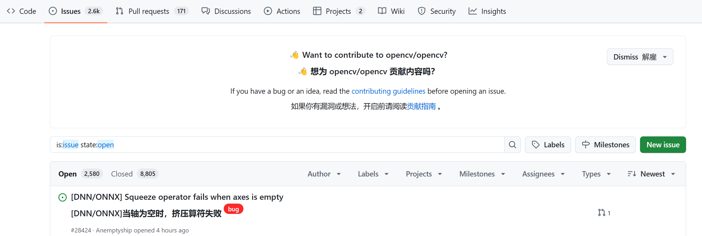
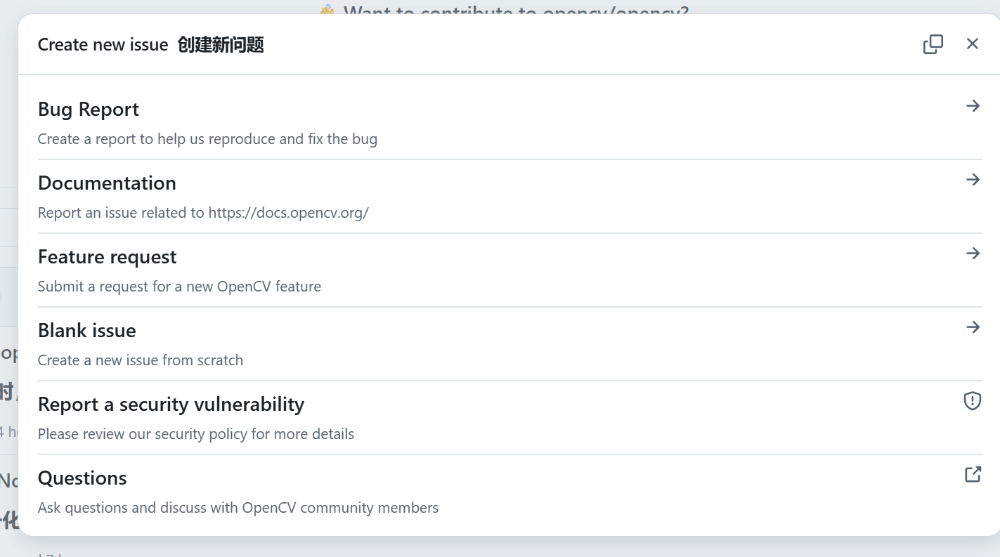

# .Github_summary
## Table
- [.Github\_summary](#github_summary)
  - [Table](#table)
  - [ISSUE\_TEMPLATE](#issue_template)
    - [EFFECT](#effect)
    - [TARGET](#target)
  - [workflow](#workflow)
    - [what's a workflow?](#whats-a-workflow)

## ISSUE_TEMPLATE
### EFFECT
These files serve to the functions of submitting feedback about issues,
and provide users with a series of structured forms.

### TARGET
force users' feedback more normalized, which help developers locate these issues, and solve them.

click to `new issues`

Through these configuration files, clicking any option again, you all will be required a structured forms to submmit.

## workflow
### what's a workflow?
The workflow refers to a series of commands, which implement automatically and sequentially.
> For instance, if you submit code now, these workflows will test, package, and deploy automatically.

